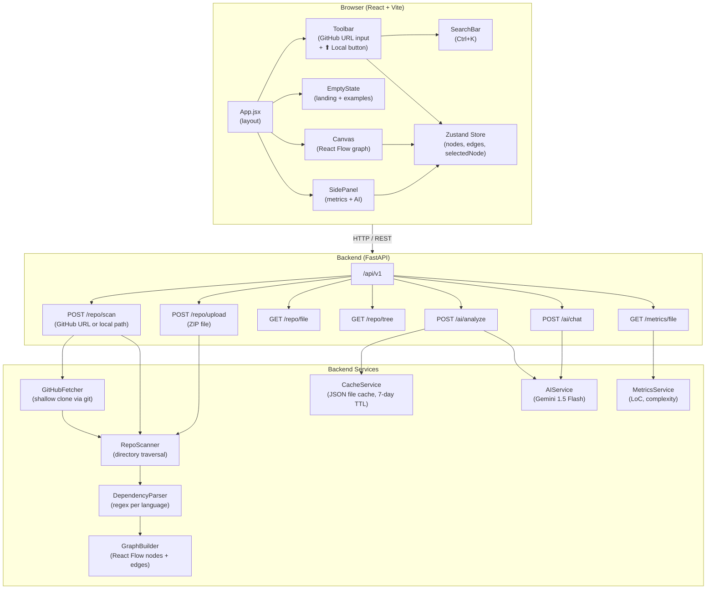
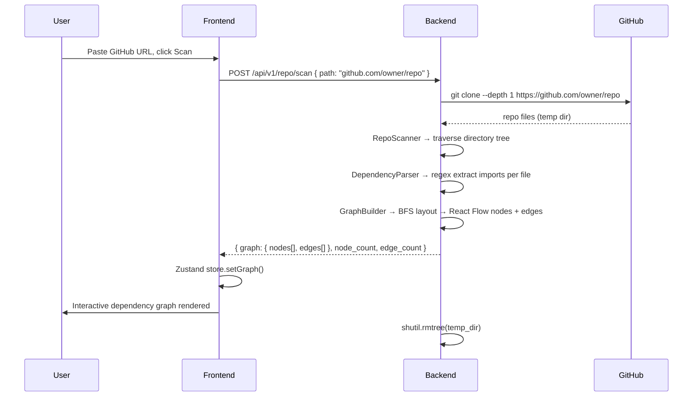

# RepoViz — Repository Structure & Dependency Visualizer

> Scan any GitHub repo or local project folder and explore its file structure, dependency graph, code metrics, and AI-powered summaries — all in the browser.

**Live demo:** https://repository-structure-analysis-and-v.vercel.app

---

## Table of Contents

- [Features](#features)
- [Architecture](#architecture)
- [Data Flow](#data-flow)
- [Local Upload Flow](#local-upload-flow)
- [API Reference](#api-reference)
- [Tech Stack](#tech-stack)
- [Project Structure](#project-structure)
- [Quick Start](#quick-start)
- [Environment Variables](#environment-variables)
- [Deployment](#deployment)
- [Supported Languages](#supported-languages)
- [Node Color Reference](#node-color-reference)

---

## Features

| Feature | Description |
|---|---|
| **GitHub scanning** | Paste any public GitHub URL — the backend shallow-clones it, scans, and streams the graph |
| **Local folder upload** | Select a project folder from your machine; the browser zips it with JSZip and POSTs to the backend |
| **Dependency graph** | Resolves intra-project imports between files and renders them as directed edges |
| **Code metrics** | LoC (total / code / comment / blank), character count, function count, cyclomatic complexity |
| **AI summaries** | Gemini 1.5 Flash explains any file in plain English, cached for 7 days |
| **AI chat** | Ask free-form questions about any file in the side panel |
| **File search** | `Ctrl+K` / `Cmd+K` fuzzy search across all scanned files |
| **React Flow canvas** | Pan, zoom, click nodes; BFS-based spiral layout keeps the graph readable |
| **Max 2 000 files** | Safety cap — prompts user to scan a subdirectory for very large repos |

---

## Architecture



---

## Data Flow

### GitHub Scan



### Local Folder Upload

```mermaid
sequenceDiagram
    participant User
    participant Browser
    participant JSZip
    participant Backend

    User->>Browser: Click ⬆ Local → select project folder
    Browser->>Browser: FileList collected via <input webkitdirectory>
    Browser->>JSZip: filesToZip(fileList) — skip node_modules, .git, dist…
    JSZip-->>Browser: Blob (DEFLATE compressed ZIP)
    Browser->>Backend: POST /api/v1/repo/upload (multipart/form-data)
    Backend->>Backend: Extract ZIP to temp dir (path traversal check)
    Backend->>Backend: Detect single top-level folder → use as scan root
    Backend->>Backend: RepoScanner → DependencyParser → GraphBuilder
    Backend-->>Browser: { graph: { nodes[], edges[] } }
    Browser->>Browser: Zustand store.setGraph()
    Browser->>User: Graph rendered — no local server needed
    Backend->>Backend: shutil.rmtree(temp_dir)
```



---

## Local Upload Flow

The local upload feature works **fully on the deployed site** — no local server required.

1. **Browser-side zipping** — `JSZip` bundles the selected folder into a single `.zip` blob. The following directories are excluded before zipping to keep size small:

   ```
   node_modules  .git  __pycache__  .venv  venv
   dist  build  .next  .cache  target  out
   .mypy_cache  .pytest_cache  coverage
   ```
   Files/folders starting with `.` are also skipped.

2. **Upload** — the zip is POSTed to `POST /api/v1/repo/upload` as `multipart/form-data`.

3. **Backend extraction** — the zip is extracted to a temp directory. Path traversal attacks are blocked (any member resolving outside the extract dir is skipped). If the zip contains a single top-level folder, that folder becomes the scan root.

4. **Scan pipeline** — same `RepoScanner → DependencyParser → GraphBuilder` pipeline as GitHub scanning.

5. **Cleanup** — `shutil.rmtree` deletes the temp dir after the response is sent.

---

## API Reference

### `POST /api/v1/repo/scan`

Scan a GitHub repo or local path (when running locally).

**Request body:**
```json
{
  "path": "https://github.com/owner/repo",
  "max_depth": 10,
  "exclude_dirs": ["node_modules", ".git"]
}
```

**Response:**
```json
{
  "status": "success",
  "base_path": "/tmp/repoviz_xyz/repo",
  "node_count": 42,
  "edge_count": 87,
  "graph": {
    "nodes": [ { "id": "...", "type": "fileNode", "position": {...}, "data": {...} } ],
    "edges": [ { "id": "...", "source": "...", "target": "...", "animated": true } ]
  }
}
```

---

### `POST /api/v1/repo/upload`

Upload a local project as a ZIP file.

**Request:** `multipart/form-data`

| Field | Type | Description |
|---|---|---|
| `file` | `.zip` | Project folder zipped by the browser |
| `max_depth` | `int` (query param) | Max directory traversal depth (default: 10) |

**Response:** Same shape as `/repo/scan`.

---

### `GET /api/v1/repo/file?path=<abs_path>`

Read raw file content (used by the side panel to load file for AI analysis).

---

### `GET /api/v1/metrics/file?path=<abs_path>`

Return detailed code metrics for a single file.

**Response:**
```json
{
  "loc_total": 120,
  "loc_code": 95,
  "loc_comment": 15,
  "loc_blank": 10,
  "char_count": 3400,
  "function_count": 8,
  "class_count": 2,
  "complexity": 12
}
```

---

### `POST /api/v1/ai/analyze`

Get a plain-English Gemini summary of a file. Responses are cached for 7 days.

**Request body:**
```json
{
  "file_path": "src/components/Canvas.jsx",
  "file_content": "...",
  "language": "React JSX",
  "force_refresh": false
}
```

---

### `POST /api/v1/ai/chat`

Ask a free-form question about a file.

**Request body:**
```json
{
  "file_path": "backend/app/core/graph_builder.py",
  "file_content": "...",
  "question": "What algorithm does this use for layout?"
}
```

---

## Tech Stack

### Backend

| Package | Version | Purpose |
|---|---|---|
| `fastapi` | 0.111.0 | REST API framework |
| `uvicorn` | 0.29.0 | ASGI server |
| `pydantic` | 2.7.1 | Request/response models |
| `pydantic-settings` | 2.2.1 | `.env` config loading |
| `httpx` | 0.27.0 | Async HTTP client |
| `python-multipart` | 0.0.9 | File upload parsing |
| `python-dotenv` | 1.0.1 | `.env` file support |

Python 3.11+ required.

### Frontend

| Package | Version | Purpose |
|---|---|---|
| `react` | 18.3.1 | UI framework |
| `reactflow` | 11.11.4 | Graph canvas (pan, zoom, nodes, edges) |
| `zustand` | 4.5.2 | Global state (nodes, edges, selected node) |
| `axios` | 1.7.2 | HTTP client |
| `jszip` | 3.10.1 | Client-side folder → ZIP for local upload |
| `vite` | 5.2.12 | Dev server + bundler |

---

## Project Structure

```
repo-visualizer/
├── backend/
│   ├── app/
│   │   ├── api/
│   │   │   └── endpoints/
│   │   │       ├── repo.py       ← /repo/scan, /repo/upload, /repo/file, /repo/tree
│   │   │       ├── ai.py         ← /ai/analyze, /ai/chat
│   │   │       └── metrics.py    ← /metrics/file
│   │   ├── core/
│   │   │   ├── config.py         ← pydantic-settings (reads .env)
│   │   │   ├── models.py         ← FileNode, Dependency dataclasses
│   │   │   └── graph_builder.py  ← BFS spiral layout → React Flow nodes + edges
│   │   ├── services/
│   │   │   ├── repo_scanner.py   ← directory traversal, FileNode construction
│   │   │   ├── dependency_parser.py ← per-language regex import extraction
│   │   │   ├── github_fetcher.py ← shallow git clone to temp dir
│   │   │   ├── ai_service.py     ← Gemini 1.5 Flash integration
│   │   │   ├── metrics_service.py ← LoC, complexity, function/class counts
│   │   │   └── cache_service.py  ← JSON file cache with TTL
│   │   └── main.py               ← FastAPI app, CORS, router mount
│   ├── requirements.txt
│   ├── run.py
│   └── .env.example
├── frontend/
│   ├── src/
│   │   ├── components/
│   │   │   ├── Canvas.jsx        ← React Flow graph canvas
│   │   │   ├── Toolbar.jsx       ← URL input + ⬆ Local upload button
│   │   │   ├── EmptyState.jsx    ← Landing page with examples + upload CTA
│   │   │   ├── SidePanel.jsx     ← File metrics + AI analysis + chat
│   │   │   ├── FileNode.jsx      ← Custom React Flow node component
│   │   │   └── SearchBar.jsx     ← Ctrl+K fuzzy file search
│   │   ├── hooks/
│   │   │   ├── useRepoGraph.js   ← scan() and uploadAndScan() actions
│   │   │   ├── useAIAnalysis.js  ← AI analyze + chat state
│   │   │   └── useMetrics.js     ← file metrics fetching
│   │   ├── services/
│   │   │   └── api.js            ← axios client: scanRepo, uploadRepo, analyzeFile…
│   │   ├── store/
│   │   │   └── graphStore.js     ← Zustand store (nodes, edges, selectedNode, loading)
│   │   ├── styles/
│   │   │   ├── globals.css       ← design system (CSS vars, layout, toolbar, empty state)
│   │   │   └── nodes.css         ← React Flow node styles
│   │   ├── App.jsx
│   │   └── main.jsx
│   ├── package.json
│   └── vite.config.js
├── setup.sh
└── README.md
```

---

## Quick Start

### Prerequisites

- Python 3.11+
- Node.js 18+
- `git` CLI installed (needed for GitHub scanning)

### 1. Clone

```bash
git clone https://github.com/vishnubishnoi17/Repository-Structure-Analysis-and-Visualization-Explorer.git
cd Repository-Structure-Analysis-and-Visualization-Explorer
```

### 2. Backend

```bash
cd backend
python -m venv .venv
source .venv/bin/activate        # Windows: .venv\Scripts\activate

pip install -r requirements.txt

cp .env.example .env
# Edit .env — see Environment Variables below

python run.py
# → http://localhost:8000
# → http://localhost:8000/docs  (Swagger UI)
```

### 3. Frontend

```bash
cd frontend
npm install
npm run dev
# → http://localhost:3000
```

Open `http://localhost:3000`. Paste a GitHub URL or click **⬆ Local** to upload a folder.

---

## Environment Variables

Create `backend/.env` from `.env.example`:

```env
# ── AI (optional) ────────────────────────────────────────────────────────────
GEMINI_API_KEY=          # Get free at https://aistudio.google.com
                         # Without this, AI analyze/chat endpoints return 503

# ── GitHub (optional) ────────────────────────────────────────────────────────
GITHUB_TOKEN=            # Raises rate limit 60 → 5 000 req/hr
                         # Required for private repos

# ── Server ───────────────────────────────────────────────────────────────────
HOST=0.0.0.0
PORT=8000
RELOAD=true              # Set false in production

# ── Scanning ─────────────────────────────────────────────────────────────────
MAX_SCAN_DEPTH=10
MAX_FILE_SIZE_KB=500     # Files larger than this are skipped for content parsing

# ── Cache ─────────────────────────────────────────────────────────────────────
CACHE_TTL_DAYS=7         # AI analysis responses cached for this many days
```

Create `frontend/.env.local`:

```env
VITE_API_BASE_URL=http://localhost:8000/api/v1
```

---

## Deployment

### Backend (Render / Railway / Fly.io)

1. Set environment variables in the dashboard (same keys as above, `RELOAD=false`).
2. Build command: `pip install -r requirements.txt`
3. Start command: `python run.py`

### Frontend (Vercel)

1. Set `VITE_API_BASE_URL` to your deployed backend URL in Vercel's environment variable settings.
2. Push to GitHub — Vercel auto-builds on every push.
3. Build command: `npm run build`
4. Output directory: `dist`

> The local upload feature works on the deployed site with no extra config — the browser zips the folder and sends it to the backend over HTTPS.

---

## Supported Languages

| Language | Extensions | Import Detection |
|---|---|---|
| Python | `.py` | `import foo` / `from foo import bar` |
| JavaScript | `.js`, `.jsx` | `import … from './…'` / `require('./…')` |
| TypeScript | `.ts`, `.tsx` | `import … from './…'` |
| C / C++ | `.c`, `.cpp`, `.h`, `.hpp` | `#include "local.h"` |
| Go | `.go` | relative import strings |
| Rust | `.rs` | `mod name;` / `use crate::…` |
| CSS / SCSS | `.css`, `.scss` | `@import`, `@use`, `@forward` |
| Other | `.json`, `.yaml`, `.md`, `.html`, `.vue`, `.svelte` | scanned, no dependency edges |

> External / third-party imports (e.g. `import React from 'react'`) are detected but not rendered as edges — only intra-project dependencies are graphed.

---

## Node Color Reference

Nodes are color-coded by file type to make the graph scannable at a glance:

| Color | Group | Extensions |
|---|---|---|
| 🔵 Cyan | Python | `.py` |
| 🟡 Amber | JavaScript | `.js`, `.jsx` |
| 🔷 Blue | TypeScript | `.ts`, `.tsx` |
| 🟢 Emerald | Styles | `.css`, `.scss`, `.less` |
| 🟠 Orange | Markup | `.html`, `.vue`, `.svelte` |
| ⚫ Gray | Config | `.json`, `.yaml`, `.toml`, `.env` |
| 🔴 Red | C / C++ | `.c`, `.cpp`, `.h`, `.hpp` |
| 🩵 Teal | Go | `.go` |
| 🟤 Brown | Rust | `.rs` |
| ⚪ White | Docs / Other | `.md`, `.txt`, everything else |

Node size scales with **lines of code** — larger nodes have more code.

---

## Keyboard Shortcuts

| Shortcut | Action |
|---|---|
| `Ctrl+K` / `Cmd+K` | Focus file search |
| `Escape` | Clear search |
| Scroll | Zoom graph in/out |
| Click + drag | Pan canvas |
| Click node | Open side panel |

---

## Limitations

- Max **2 000 files** per scan. Larger repos should target a subdirectory.
- Files over **500 KB** are skipped for content parsing (still shown as nodes).
- Only **public** GitHub repos supported without a `GITHUB_TOKEN`.
- AI features require a `GEMINI_API_KEY` — the rest of the app works without one.
- Local path scanning (`/home/user/project`) only works when running the backend locally; use **⬆ Local** (folder upload) on the deployed site.