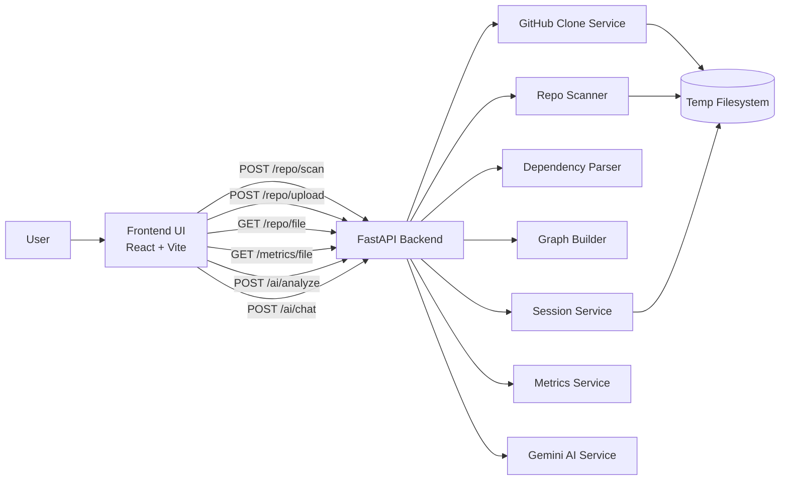
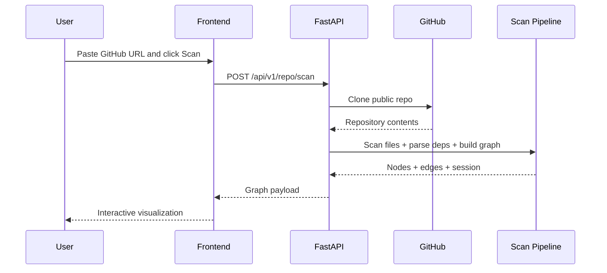
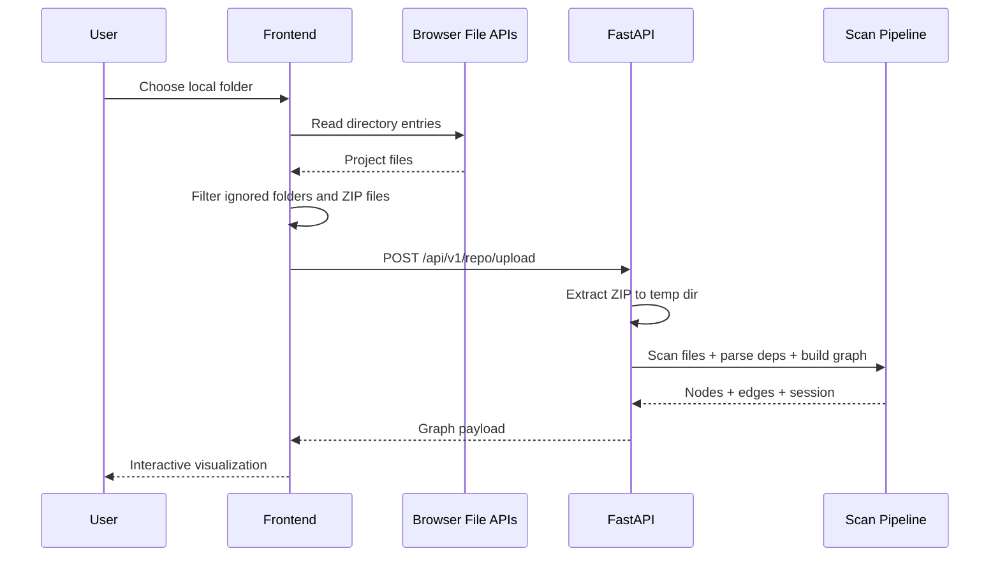

# RepoViz

RepoViz is a local-first repository visualizer for GitHub repositories and local project folders. It scans a codebase, builds a dependency-aware graph, shows file metrics, and lets you inspect files with AI-assisted summaries and Q&A.

It is designed to be easy to run on a laptop, straightforward to demo, and practical to extend.

## What You Get

- Scan a public GitHub repository from a URL or `owner/repo`
- Upload and scan a local project folder directly from the browser
- Visualize files and dependencies as an interactive graph
- Inspect per-file metrics and file contents
- Ask AI questions about a file or generate a summary
- Keep scanned repos available through backend sessions so the UI can continue reading files after the initial scan

## Screens At A Glance

- Frontend: React + Vite + React Flow
- Backend: FastAPI
- AI provider: Google Gemini
- Local upload strategy: browser-side ZIP creation, backend extraction, then normal scan pipeline

## Architecture



## Scan Flows

### GitHub Repository Flow



### Local Folder Upload Flow



## Project Structure

```text
repo-visualizer/
├── backend/
│   ├── app/
│   │   ├── api/endpoints/
│   │   │   ├── ai.py
│   │   │   ├── metrics.py
│   │   │   └── repo.py
│   │   ├── core/
│   │   │   ├── config.py
│   │   │   ├── graph_builder.py
│   │   │   └── models.py
│   │   ├── services/
│   │   │   ├── ai_service.py
│   │   │   ├── cache_service.py
│   │   │   ├── dependency_parser.py
│   │   │   ├── github_fetcher.py
│   │   │   ├── metrics_service.py
│   │   │   ├── repo_scanner.py
│   │   │   └── session_service.py
│   │   └── main.py
│   ├── .env.example
│   ├── requirements.txt
│   └── run.py
├── frontend/
│   ├── src/
│   │   ├── components/
│   │   ├── hooks/
│   │   ├── services/
│   │   ├── store/
│   │   ├── styles/
│   │   ├── utils/
│   │   ├── App.jsx
│   │   └── main.jsx
│   ├── .env.example
│   ├── package.json
│   └── vite.config.js
├── setup.sh
└── README.md
```

## Feature Breakdown

### 1. Repository Scanning

RepoViz supports two entry points:

- GitHub URL, for example `https://github.com/pallets/itsdangerous`
- GitHub shorthand, for example `pallets/itsdangerous`
- Local folder upload from the browser

### 2. Dependency Graph

The backend scans supported files, parses project-local imports and references, and returns nodes plus edges that the frontend renders with React Flow.

### 3. File Metrics

The metrics panel can show:

- Total lines
- Code lines
- Blank lines
- Comment lines
- Character count
- Function count
- Class count
- Complexity for supported languages

### 4. AI Analysis

Gemini is used for:

- File summaries
- Free-form file Q&A

If `GEMINI_API_KEY` is not set, the rest of the app still works; only AI endpoints fail.

## Supported File Types

```text
.py .js .mjs .cjs .ts .mts .cts .jsx .tsx
.c .cpp .h .hpp
.java .go .rs .kt .kts .swift
.css .scss .less
.json .yaml .yml .toml .ini .cfg .conf
.md .txt .env .sql .graphql .gql
.html .vue .svelte .xml
.rb .php .sh
Dockerfile Makefile Procfile .gitignore .dockerignore
```

## Ignored Directories

These directories are skipped during local upload filtering and backend scanning:

```text
node_modules
.git
__pycache__
.venv
venv
dist
build
.next
.cache
target
out
.mypy_cache
.pytest_cache
coverage
```

## Requirements

Install these first:

- Python 3.10+
- Node.js 18+
- npm
- Git

Recommended:

- Google AI Studio API key for Gemini features
- GitHub token if you expect GitHub clone rate limits

## Quick Start

### Option 1: Bootstrap With The Setup Script

```bash
chmod +x setup.sh
./setup.sh
```

Then start the two servers:

```bash
cd backend
source .venv/bin/activate
python run.py
```

In a second terminal:

```bash
cd frontend
npm run dev
```

Open `http://localhost:3000`.

### Option 2: Manual Setup

#### Backend

```bash
cd backend
python3 -m venv .venv
source .venv/bin/activate
pip install -r requirements.txt
cp .env.example .env
```

Edit `backend/.env` and set at least:

```env
GEMINI_API_KEY=
GEMINI_MODEL=gemini-2.5-flash
GITHUB_TOKEN=
HOST=0.0.0.0
PORT=8000
RELOAD=True
CACHE_TTL_DAYS=7
MAX_SCAN_DEPTH=10
MAX_FILE_SIZE_KB=500
```

Run the backend:

```bash
python run.py
```

#### Frontend

```bash
cd frontend
npm install
cp .env.example .env.local
```

Run the frontend:

```bash
npm run dev
```

Open `http://localhost:3000`.

## All Commands

### Root-Level Commands

```bash
./setup.sh
```

Bootstraps backend and frontend dependencies.

### Backend Commands

```bash
cd backend
python3 -m venv .venv
source .venv/bin/activate
pip install -r requirements.txt
python run.py
```

Useful backend commands:

```bash
cd backend
source .venv/bin/activate
python run.py
```

Starts FastAPI on the configured `HOST` and `PORT`.

```bash
curl http://localhost:8000/health
```

Checks whether the backend is alive.

```bash
curl -X POST http://localhost:8000/api/v1/repo/scan \
  -H "Content-Type: application/json" \
  -d '{"path":"https://github.com/pallets/itsdangerous","max_depth":10}'
```

Tests a GitHub scan directly without the frontend.

### Frontend Commands

```bash
cd frontend
npm install
npm run dev
```

Starts the Vite development server on `http://localhost:3000`.

```bash
cd frontend
npm run build
```

Creates a production build in `frontend/dist`.

```bash
cd frontend
npm run preview
```

Serves the production build locally on the Vite preview port.

```bash
cd frontend
npm run lint
```

Runs ESLint on frontend source files.

## Environment Variables

### Backend

| Variable | Required | Default | Purpose |
|---|---|---:|---|
| `GEMINI_API_KEY` | No | `""` | Enables AI summary and chat endpoints |
| `GEMINI_MODEL` | No | `gemini-2.5-flash` | Default Gemini model |
| `GITHUB_TOKEN` | No | `""` | Helps avoid anonymous GitHub rate limits |
| `HOST` | No | `0.0.0.0` | Backend bind host |
| `PORT` | No | `8000` | Backend port |
| `RELOAD` | No | `True` | Enables auto-reload in development |
| `CACHE_TTL_DAYS` | No | `7` | AI/cache TTL |
| `MAX_SCAN_DEPTH` | No | `10` | Max scan depth |
| `MAX_FILE_SIZE_KB` | No | `500` | Max file size for content parsing |

### Frontend

| Variable | Required | Default | Purpose |
|---|---|---:|---|
| `VITE_API_BASE_URL` | No | `/api/v1` | API base URL for frontend requests |

## API Guide

### Health Check

`GET /health`

Response:

```json
{
  "status": "ok",
  "service": "repo-visualizer"
}
```

### Scan Repository

`POST /api/v1/repo/scan`

Request:

```json
{
  "path": "https://github.com/pallets/itsdangerous",
  "max_depth": 10,
  "exclude_dirs": null
}
```

Use this when:

- scanning a GitHub repository from the UI
- scanning a local filesystem path when the backend is running on the same machine and you want to call the API directly

### Upload Local Project

`POST /api/v1/repo/upload`

Form field:

- `file`: ZIP archive generated by the frontend

Optional query parameter:

- `max_depth`

### Read File

`GET /api/v1/repo/file`

Supported modes:

- `?path=/absolute/or/local/path`
- `?session_id=...&rel_path=src/App.jsx`

### File Metrics

`GET /api/v1/metrics/file`

Uses the same file reference format as the file-read API.

### AI Summary

`POST /api/v1/ai/analyze`

Request:

```json
{
  "file_path": "src/App.jsx",
  "file_content": "file contents here",
  "language": "React JSX",
  "force_refresh": false
}
```

### AI Chat

`POST /api/v1/ai/chat`

Request:

```json
{
  "file_path": "src/App.jsx",
  "file_content": "file contents here",
  "question": "What does this component do?"
}
```

## Frontend To Backend Interaction

```mermaid
flowchart TD
    A[Toolbar / Empty State] --> B[useRepoGraph hook]
    B --> C[frontend/services/api.js]
    C --> D[/api/v1/repo/scan]
    C --> E[/api/v1/repo/upload]
    C --> F[/api/v1/repo/file]
    C --> G[/api/v1/metrics/file]
    C --> H[/api/v1/ai/analyze]
    C --> I[/api/v1/ai/chat]
```

## Local Folder Upload Notes

The local folder flow now supports:

- browser directory selection through `showDirectoryPicker()` when available
- hidden file input fallback for browsers that do not support that API
- browser-side ZIP creation with preserved relative paths
- skip-directory filtering before upload

If the frontend says `No uploadable files found in the selected folder`, the usual causes are:

- the folder only contains ignored directories such as `node_modules` or `dist`
- the browser returned no files for the selected directory
- the chosen folder is effectively empty after filtering

## Development Workflow

### Run Everything

Terminal 1:

```bash
cd backend
source .venv/bin/activate
python run.py
```

Terminal 2:

```bash
cd frontend
npm run dev
```

### Typical Edit Loop

1. Start backend.
2. Start frontend.
3. Open `http://localhost:3000`.
4. Scan a GitHub repo or upload a local folder.
5. Make changes.
6. Rebuild frontend with `npm run build` before shipping.

## Production Notes

- Set `RELOAD=False` in `backend/.env`
- Serve the frontend build output from `frontend/dist`
- Point `VITE_API_BASE_URL` to the deployed backend if frontend and backend are on different origins
- Restrict CORS instead of leaving it fully open
- Add authentication if this becomes multi-user

## Troubleshooting

### Backend Won't Start

Check:

```bash
cd backend
source .venv/bin/activate
python run.py
```

Then test:

```bash
curl http://localhost:8000/health
```

If this fails, verify:

- Python version
- virtual environment activation
- dependency installation
- `PORT` already in use

### Frontend Cannot Reach API

Verify:

- backend is running on `http://localhost:8000`
- Vite dev server is running on `http://localhost:3000`
- `VITE_API_BASE_URL` is correct
- the `/api` proxy in [vite.config.js](/home/jaishreeram/Downloads/repo-visualizer/frontend/vite.config.js:1) still points to the backend

### Local Folder Upload Fails

Try:

- selecting a real source folder instead of a build output folder
- checking whether the folder only contains ignored directories
- using a Chromium-based browser if your current browser has limited directory-selection support

### AI Features Fail

Check `backend/.env`:

```env
GEMINI_API_KEY=your_key_here
GEMINI_MODEL=gemini-2.5-flash
```

Then restart the backend.

## Recommended Demo Inputs

GitHub examples:

```text
https://github.com/pallets/itsdangerous
https://github.com/sindresorhus/is
https://github.com/simonw/shot-scraper
https://github.com/realpython/codetiming
https://github.com/charmbracelet/harmonica
```

Local examples:

- a small React app
- a Python utility repo
- a Go CLI project

## Roadmap Ideas

- drag-and-drop folder upload
- private GitHub repository support
- richer dependency parsing across more languages
- persisted sessions or saved scans
- graph filters by language, directory, or file size
- export graph as image or JSON

## License

Add your preferred license here if you plan to distribute or publish the project.
