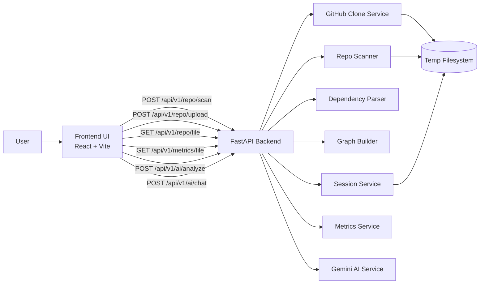
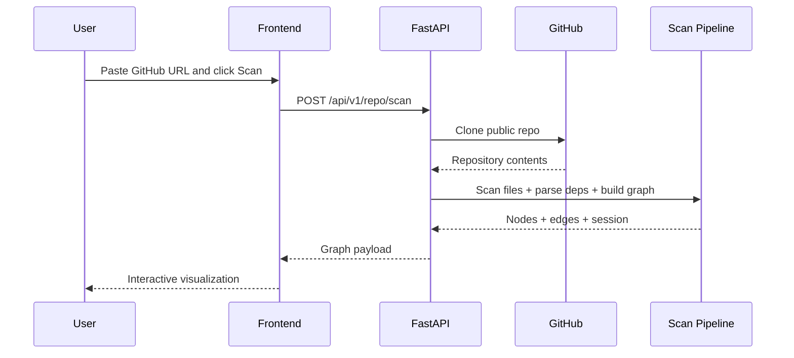
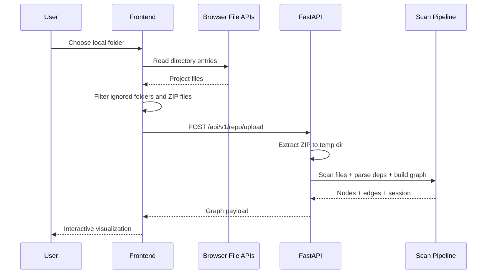

# RepoViz

> Repository Structure Analysis and Visualisation System

**Live demo:** https://repository-structure-analysis-and-v.vercel.app

RepoViz scans a GitHub repository or local project folder, builds a dependency-aware interactive graph, surfaces per-file metrics, and lets you inspect any file with AI-powered summaries and Q&A — all running locally on a laptop.

---

## Stack

| Layer | Technology |
|---|---|
| Frontend | React 18, Vite, React Flow, Zustand, Axios |
| Backend | FastAPI, Uvicorn, Pydantic v2 |
| AI | Google Gemini (`gemini-2.5-flash`) |
| Repo cloning | GitPython |

---

## Features

- Scan any public GitHub repo by URL or `owner/repo` slug
- Upload a local project folder directly from the browser (browser-side ZIP → backend extraction)
- Interactive dependency graph with React Flow
- Per-file metrics: LOC, blank/comment lines, function/class count, complexity
- AI file summary and free-form Q&A via Gemini (optional — rest of app works without it)
- Session management keeps scanned files accessible across AI queries

---

## Quick Start

### Option 1 — Setup script

```bash
chmod +x setup.sh && ./setup.sh
```

Then in two terminals:

```bash
# Terminal 1
cd backend && source .venv/bin/activate && python run.py

# Terminal 2
cd frontend && npm run dev
```

Open `http://localhost:5173`.

### Option 2 — Manual

**Backend**

```bash
cd backend
python3 -m venv .venv && source .venv/bin/activate
pip install -r requirements.txt
cp .env.example .env   # edit and set GEMINI_API_KEY
python run.py
```

**Frontend**

```bash
cd frontend
npm install
cp .env.example .env.local
npm run dev
```

---

## Environment Variables

### Backend (`backend/.env`)

| Variable | Required | Default | Purpose |
|---|---|---|---|
| `GEMINI_API_KEY` | No | `""` | Enables AI endpoints |
| `GEMINI_MODEL` | No | `gemini-2.5-flash` | Gemini model |
| `GITHUB_TOKEN` | No | `""` | Avoids anonymous rate limits |
| `HOST` | No | `0.0.0.0` | Bind host |
| `PORT` | No | `8000` | Bind port |
| `RELOAD` | No | `True` | Hot-reload in dev |
| `CACHE_TTL_DAYS` | No | `7` | Cache TTL |
| `MAX_SCAN_DEPTH` | No | `10` | Max directory depth |
| `MAX_FILE_SIZE_KB` | No | `500` | Max file size to parse |

### Frontend (`frontend/.env.local`)

| Variable | Required | Default | Purpose |
|---|---|---|---|
| `VITE_API_BASE_URL` | No | `/api/v1` | Backend API base URL |

---

## API Reference

| Method | Route | Purpose |
|---|---|---|
| `GET` | `/health` | Health check |
| `POST` | `/api/v1/repo/scan` | Scan a GitHub repo |
| `POST` | `/api/v1/repo/upload` | Upload and scan a local folder ZIP |
| `GET` | `/api/v1/repo/file` | Read a file by path or session |
| `GET` | `/api/v1/metrics/file` | Per-file metrics |
| `POST` | `/api/v1/ai/analyze` | AI file summary |
| `POST` | `/api/v1/ai/chat` | AI Q&A on a file |

**Scan example**

```bash
curl -X POST http://localhost:8000/api/v1/repo/scan \
  -H "Content-Type: application/json" \
  -d '{"path":"https://github.com/pallets/itsdangerous","max_depth":10}'
```

---

## Architecture



### GitHub Repository Flow



### Local Folder Upload Flow



---

## Project Structure

```
repo-visualizer/
├── backend/
│   ├── app/
│   │   ├── api/endpoints/     # ai.py  metrics.py  repo.py
│   │   ├── core/              # config  graph_builder  models
│   │   └── services/          # ai  cache  dep_parser  github  metrics  scanner  session
│   ├── requirements.txt
│   └── run.py
├── frontend/
│   └── src/
│       ├── components/
│       ├── hooks/
│       ├── services/
│       ├── store/
│       └── App.jsx
└── setup.sh
```

---

## Supported Languages

Python, JavaScript/TypeScript (incl. JSX/TSX), C/C++, Java, Go, Rust, Kotlin, Swift, Ruby, PHP, Shell, CSS/SCSS/Less, HTML, Vue, Svelte, JSON, YAML, TOML, SQL, GraphQL, Markdown, Dockerfile, Makefile, and more.

---

## Troubleshooting

**Backend won't start** — check Python version (3.10+), venv activation, and that the port isn't already in use.

**Frontend can't reach API** — verify backend is on `:8000`, the Vite proxy in `vite.config.js` is correct, and `VITE_API_BASE_URL` is set.

**Local upload finds no files** — you likely selected a folder that only contains ignored directories (`node_modules`, `dist`, `.git`, etc.).

**AI endpoints fail** — set `GEMINI_API_KEY` in `backend/.env` and restart the backend.

---

## Good Demo Repos

```
https://github.com/pallets/itsdangerous
https://github.com/sindresorhus/is
https://github.com/simonw/shot-scraper
https://github.com/realpython/codetiming
```

---

